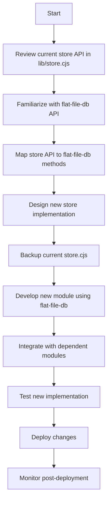

# Store Replacement Plan
*Replace current store implementation with flat-file-db while maintaining API compatibility*

## Plan Overview

1. **Analyze the Existing Store Module**  
   - **Goal:** Understand current functionality and API in `lib/store.cjs`
   - **Actions:**
     - Review key functions (init, get, set, update, delete)
     - Identify data structure, persistence, and access patterns

2. **Examine the Flat-File-DB Package**
   - **Goal:** Map flat-file-db functions to current store API
   - **Actions:**
     - Review package documentation and methods
     - Create translation mapping from current API to flat-file-db

3. **Design the New Store Implementation**
   - **Goal:** Integrate flat-file-db while preserving API
   - **Actions:**
     - Define new implementations for all store methods
     - Maintain consistent error handling
     - Handle file paths and configuration

4. **Plan the Refactor Process**
   - **Goal:** Ensure smooth transition without breaking changes
   - **Actions:**
     - Backup existing store.cjs
     - Develop new module separately
     - Replace persistence layer
     - Add initialization logic

5. **Test the New Implementation**
   - **Goal:** Validate behavior matches existing store
   - **Actions:**
     - Run/create unit tests
     - Verify CRUD operations
     - Check integration points

6. **Rollout and Deployment**
   - **Goal:** Safe deployment of changes
   - **Actions:**
     - Review changes
     - Merge after testing
     - Monitor for issues

## Implementation Flow

## Detailed Steps

1. **Code Analysis**
   - Review `lib/store.cjs` implementation
   - Document API functions
   - Check usage in related files

2. **Integration Planning**
   - Install flat-file-db: `npm install flat-file-db`
   - Map current functions to flat-file-db methods

3. **Implementation**
   - Replace storage logic:
     - Initialize flat-file-db
     - Implement CRUD methods
   - Maintain identical API interface

4. **Testing**
   - Write/update unit tests
   - Verify all operations
   - Test integration points

5. **Documentation**
   - Update inline documentation
   - Document new configuration needs

6. **Deployment**
   - Merge after testing
   - Keep rollback plan ready
   - Monitor system post-deployment

## Notes
- Maintain exact API compatibility
- Use flat-file-db for persistence layer
- Ensure proper error handling
- Keep existing configuration patterns where possible